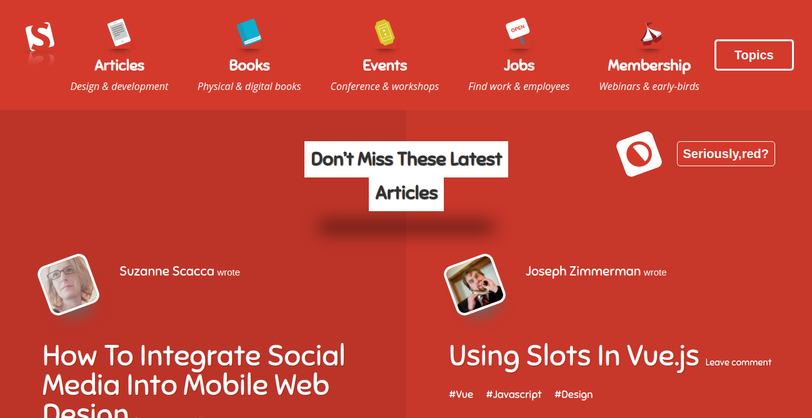

# DESIGN-TEARDOWN

In this  project,the main objective is to clone  – Smashing Magazine. The goal for this exercise is to start training yourself to think in terms of visual hierarchy, typography and design principles and to create a grayscale heat map of the website that indicates which elements have the greatest weight in the visual hierarchy.

[Smashing Magazine ](https://smashingmagazine.com)

## Screenshot

 

## Technologies

- HTML 
- CSS

## Live Demo

[Live Demo Link](https://raw.githack.com/kobiyoyo/DESIGN-TEARDOWN/master/index.html)

## Authors

👤 **Adama Chubiyojo Desmond**

-  [Github](https://github.com/kobiyoyo)
-  [Twitter](https://twitter.com/_kobiyoyo)
-  [Linkedin](https://www.linkedin.com/in/chubiyojo-adama/)
-  [Email](mailto:adamachubi@gmail.com)

👤 **Danilo Zagarcanin**

- [Github](https://github.com/danilozag1992)
- [Twitter](https://twitter.com/danilo96061514)
- [Linkedin](https://www.linkedin.com/in/danilo-zagarcanin-88169b185/)
- [Email](mailto:danilozagarcanin@gmail.com)

## 🤝 Contributing

Contributions, issues and feature requests are welcome!

Feel free to check the [issues page](issues/).

## Show your support

Give a ⭐️ if you like this project!

## Acknowledgments

- Hat tip to anyone whose code was used
- Inspiration
- etc

## 📝 License

This project is [MIT](lic.url) licensed.
